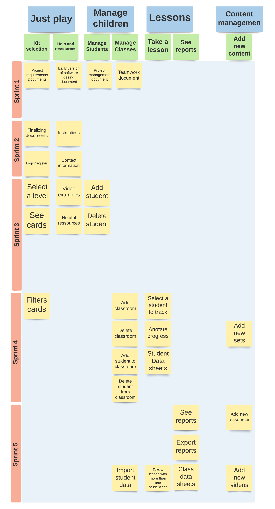

# Project Management

This page provides a general overview of the assigned tasks and roles for the duration of five sprints (subject to change).

## Story Map

## Project Plan

### Sprint 1

_Due: January 30 2023_

**Task**

| Task                              | Related US | Assigned To                      | Due Date     |
| --------------------------------- | ---------- | -------------------------------- | ------------ |
| **Project Requirements document** | N/A        | Eric Weber                       | Jan 30, 2023 |
| **High-level architecture**       | N/A        | Cameron Matthew, Armaan Mangat   | Jan 30, 2023 |
| **Major data elements**           | N/A        | Cameron Matthew, Armaan Mangat   | Jan 30, 2023 |
| **Interaction scenarios**         | N/A        | Cameron Matthew, Armaan Mangat   | Jan 30, 2023 |
| **Low-fidelity user interface**   | N/A        | Julian Gallego Franco, Amman Das | Jan 30, 2023 |
| **Project Management document**   | N/A        | Julian Gallego Franco            | Jan 30, 2023 |
| **Team work document**            | N/A        | Kashish Aggarwal                 | Jan 30, 2023 |

_Estimated sprint velocity_: **0**
