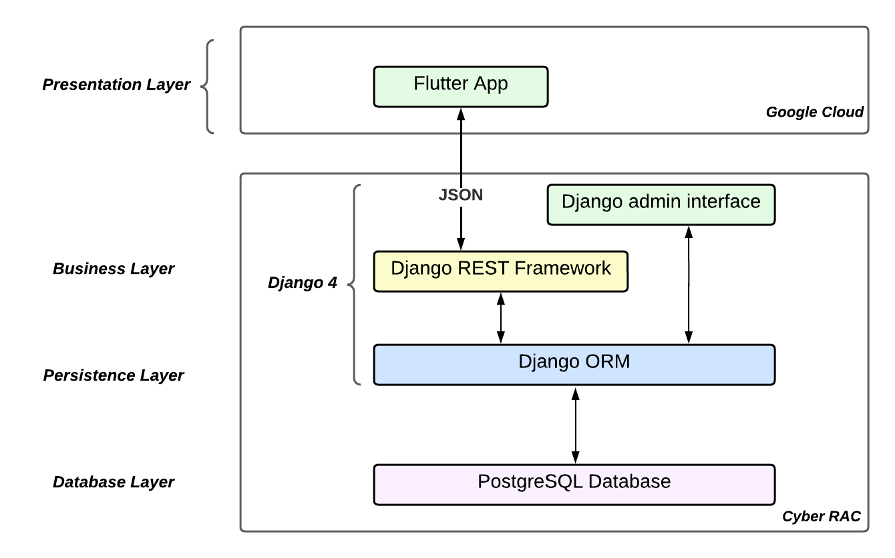
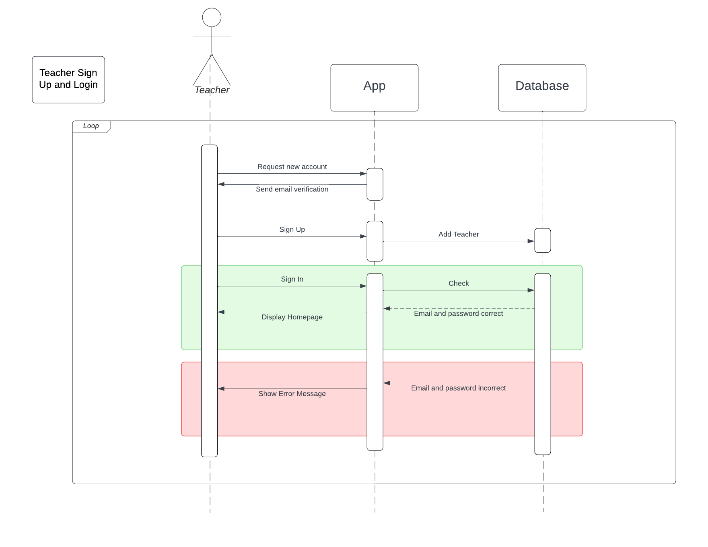
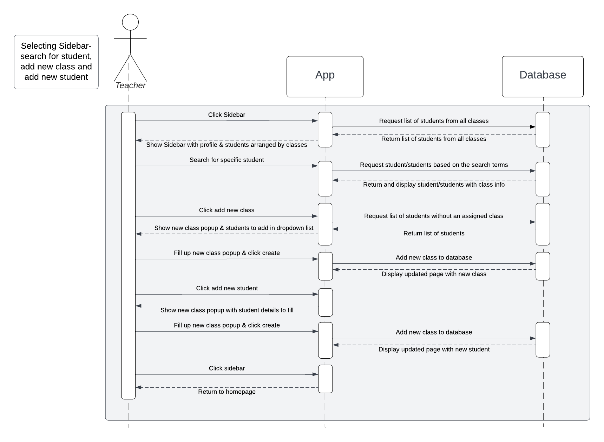
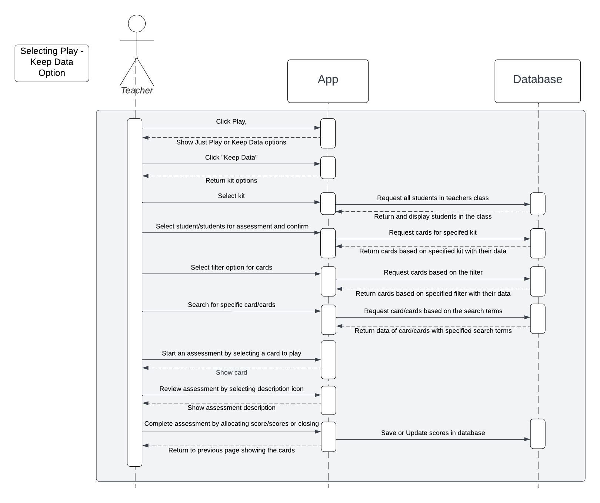
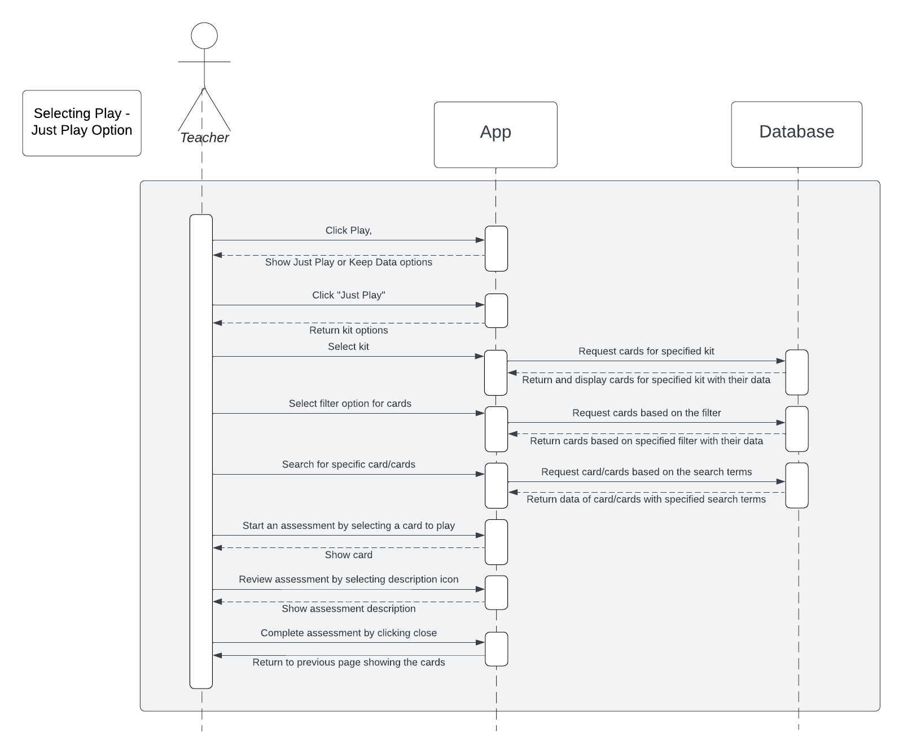
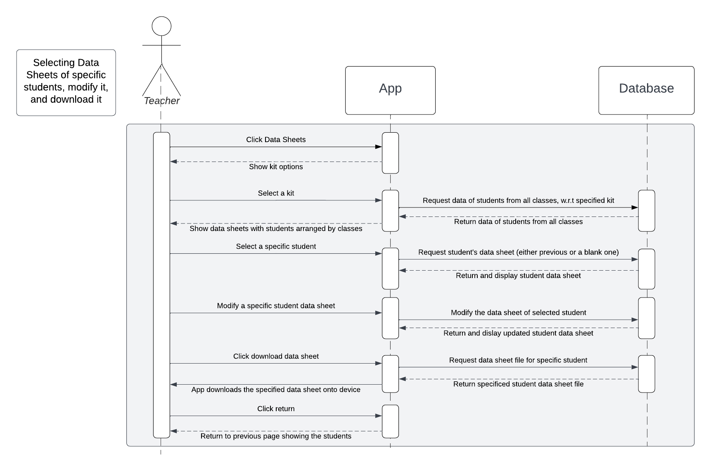
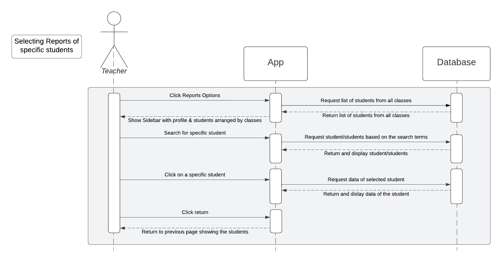
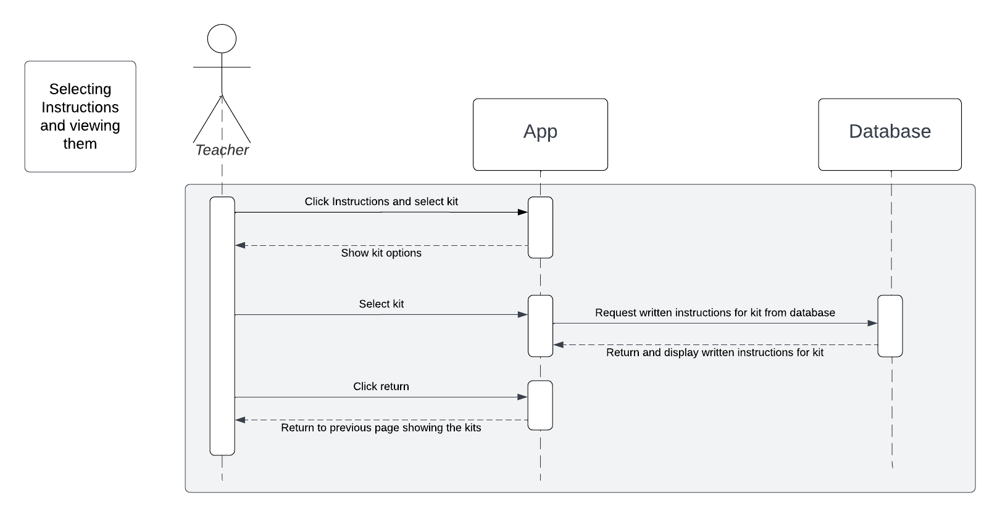
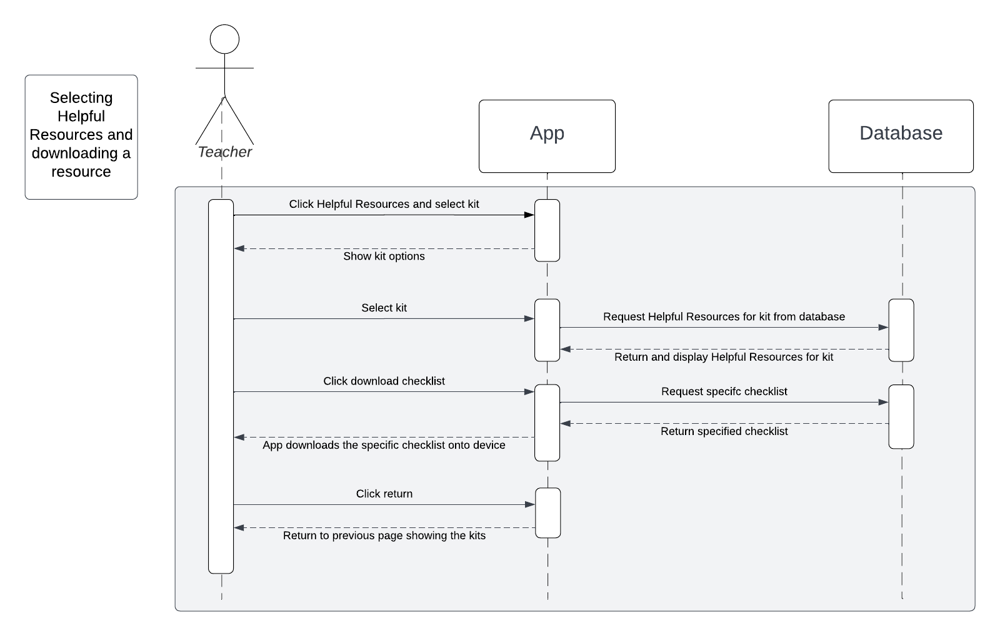
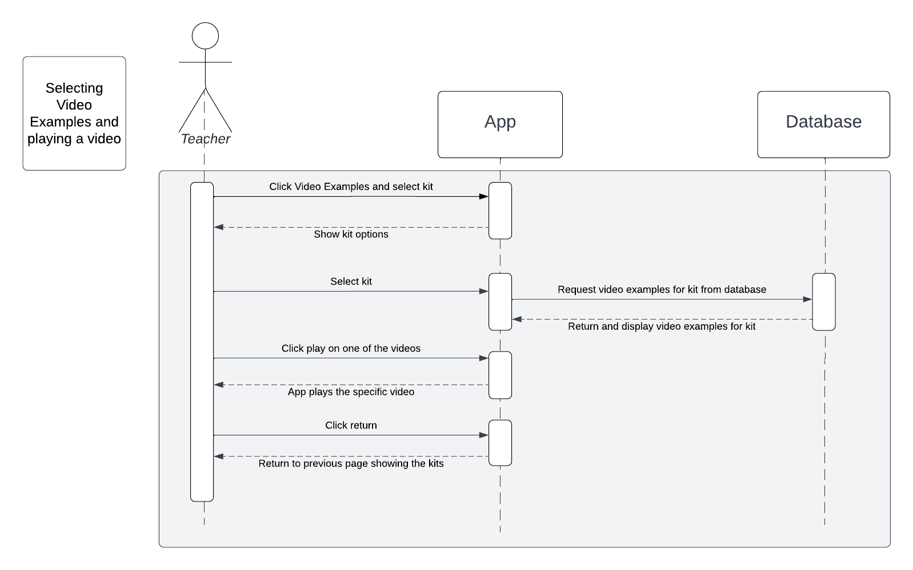

# Software Design

This page includes a short description of the overall architecture style of the system, its high-level system components, and their logical (what data they exchange) and control (how they invoke each other) dependencies.

## Architecture Diagram

This is a short description of the architecture.

## UML Class Diagram

This is a short description of logical entities of the domain in a UML diagram.

## Sequence Diagrams

Multiple sequence diagrams depicting the most important scenarios.

## Low-Fidelity User interface

Some low-fidelity wireframes outlining the main aspects of the app and its general navigation.

