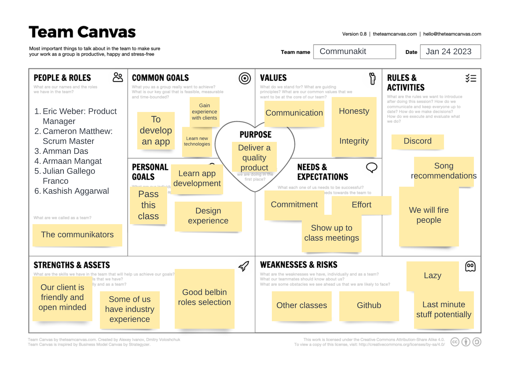

# Teamwork

This page provides an overview of the team and its members.

## Team Canvas

## Belbin Roles

Source: https://www.belbin.com/about/belbin-team-roles.

| Name                      | Most Preferred | Manageable     | Least Preferred|
| --------------------------| ---------------| ---------------| ---------------|
| **Eric Weber**            | PL, SP, RI     | IMP, RW, CF    | CO, SH, ME     |
| **Julian Gallego Franco** | CO, SH, CF     | ME, IMP, RI    | TW, PL, SP     |
| **Cameron Matthew**       |                |                |                |
| **Kashish Aggarwal**      | TW, RI, SP     | CO, PL, IMP    | SH, ME, CF     |
| **Amman Das**             | TW, CO, SH     | ME, IMP, CF    | PL, SP, RI     |
| **Armaan Mangat**         | ME, IMP, TW    | CF, SP, CO     | PL, SH, RI     |

 ### Thinking Roles

 **Plant (PL)**
 Tends to be highly creative and good at solving problems in unconventional ways.

 1. Eric Weber (preferred)
 2. Cameron Matthew(manageable)

 **Monitor Evaluation (ME)**
 Provides a logical eye, making impartial judgements where required and weighs up the team's options in a dispassionate way.

 1. Armaan Mangat (preferred)
 2. Julian Gallego Franco (manageable)
 3. Amman Das (Manageable)

 **Specialist (SP)**
 Brings in-depth knowledge of a key area to the team.

 1. Eric Weber (preferred)
 2. Kashish Aggarwal (preferred)
 2. Armaan Mangat (manageable)

 ### Action Roles

 **Shaper (SH)**
 Provides the necessary drive to ensure that the team keeps moving and does not lose focus or momentum.

 1. Julian Gallego Franco (preferred)
 2. Amman Das (preferred)

 **Implementer (IMP)**
 Needed to plan a workable strategy and carry it out as efficiently as possible.

 1. Armaan Mangat (preferred)
 2. Eric Weber (manageable)
 3. Julian Gallego Franco (manageable)
 4. Kashish Aggarwal (manageable)
 5. Amman Das (manageable)

 **Completer Finisher (CF)**
 Most effectively used at the end of tasks to polish and scrutinise the work for errors, subjecting it to the highest standards of quality control.

 1. Julian Gallego Franco (preferred)
 2. Eric Weber (manageable)
 3. Armaan Mangat (manageable)
 4. Amman Das (manageable)

 ### People Roles

 **Resource Investigator (RI)**
 Uses their inquisitive nature to find ideas to bring back to the team.
 
 1. Kashish Aggarwal (preferred)
 2. Eric Weber (preferred)
 3. Julian Gallego Franco (manageable)

 **Teamworker (TW)**
 Helps the team to gel, using their versatility to identify the work required and complete it on behalf of the team.

 1. Amman Das (preferred)
 2. Kashish Aggarwal (preferred)
 3. Armaan Mangat (preferred)

 **Co-ordinator (CO)**
 Needed to focus on the team's objectives, draw out team members and delegate work appropriately.

 1. Julian Gallego Franco (preferred)
 2. Amman Das (preferred)
 3. Kashish Aggarwal (manageable)
 4. Armaan Mangat (manageable)

